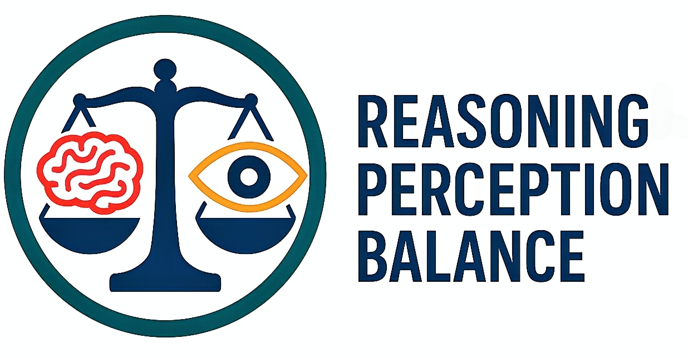
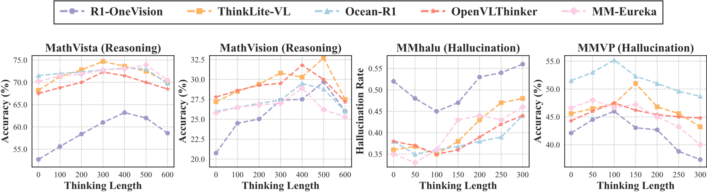

<p align="center">
  
</p>

# More Thinking, Less Seeing? Assessing Amplified Hallucination in Multimodal Reasoning Models


<a href='https://arxiv.org/abs/2505.21523'></a> <a href='https://mlrm-halu.github.io/ '></a> <a href='https://huggingface.co/datasets/kzhou35/mssbench/tree/main'></a>
</a>


## News
- \[**May 2025**\]  [Paper](https://arxiv.org/abs/2505.21523) is now available. 📢


## TO DO 
- [√] Release visualization tools and reasoning length control  strategies.
- [√] Release small-scale RH-Bench benchmark.
-  [ ]  Expand and refine RH-Bench to support more multimodal reasoning model. Coming soon!


## ❗Abstract
Test-time compute has empowered multimodal large language models to generate extended reasoning chains, yielding strong performance on tasks such as multimodal math reasoning. However, we observe that this improved reasoning ability often comes with increased hallucination: as generations become longer, models tend to drift away from image-grounded content and rely more on language priors. Attention analysis reveals that longer reasoning chains reduce focus on visual inputs, contributing to hallucination. To systematically study this phenomenon, we introduce RH-AUC, a metric that quantifies how a model’s perception accuracy changes with reasoning length, enabling evaluation of whether the model preserves visual grounding while reasoning. We also release RH-Bench, a diagnostic benchmark covering diverse multimodal tasks, designed to jointly assess the balance of reasoning ability and hallucination. We find that (i) larger models generally exhibit a better balance between reasoning and perception; and (ii) this balance depends more on the types and domains of the training data than its volume. Our findings highlight the need for evaluation frameworks that account for both reasoning quality and perceptual reliability.


## 🎯 Visualization 

```
>> conda create -n myenv python=3.9
>> conda activate myenv
>> pip install -r requirements.txt
```


## 🕹️ Reasoning Length Contorl

**Step 1** 1111
```

```
**Step 2**    1111

```

```



## 🧐 Evaluation 

### Model
| Model                          | Link                              |
|--------------------------------|-------------------------------------------|
|R1-Onevision          | 🤗 [R1-Onevision](https://huggingface.co/Fancy-MLLM/R1-Onevision-7B-RL)|
|ThinkLite-VL          | 🤗 [ThinkLite-VL ](https://huggingface.co/russwang/ThinkLite-VL-7B)     |
|MM-Eureka-Qwen        | 🤗 [MM-Eureka-Qwen ](https://huggingface.co/FanqingM/MM-Eureka-Qwen-7B)   |
|Vision-R1        | 🤗 [Vision-R1](https://huggingface.co/JefferyZhan/Qwen2.5-VL-7B-Instruct-Vision-R1)   |
|Ocean-R1        | 🤗 [Ocean-R1 ](https://huggingface.co/minglingfeng/Ocean_R1_7B_Instruct)   |
|MM-R1       | 🤗 [MM-R1 ](https://huggingface.co/MMR1/MMR1-Math-v0-7B)   |
|Curr-ReFT       | 🤗 [MM-R1 ](https://huggingface.co/ZTE-AIM/3B-Curr-ReFT)   |
|LLM- R1      | 🤗 [LLM-R1 ](https://huggingface.co/VLM-Reasoner/LMM-R1-MGT-PerceReason)   |
|Skywork-R1V      | 🤗 [Skywork-R1V](https://huggingface.co/Skywork/Skywork-R1V-38B)   |


```

```


### Citation
If you find the code is valuable, please use this citation.
```
 @misc{liu2025thinkingseeingassessingamplified,
      title={More Thinking, Less Seeing? Assessing Amplified Hallucination in Multimodal Reasoning Models}, 
      author={Chengzhi Liu and Zhongxing Xu and Qingyue Wei and Juncheng Wu and James Zou and Xin Eric Wang and Yuyin Zhou and Sheng Liu},
      year={2025},
      eprint={2505.21523},
      archivePrefix={arXiv},
      primaryClass={cs.CL},
      url={https://arxiv.org/abs/2505.21523}, 
```


